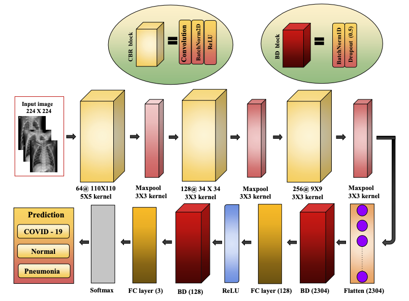
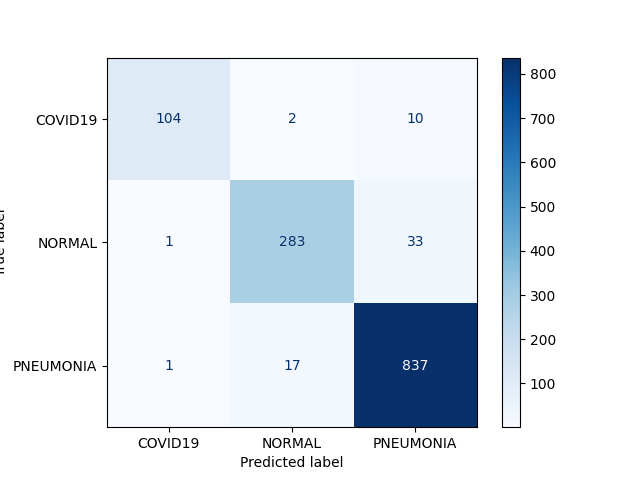
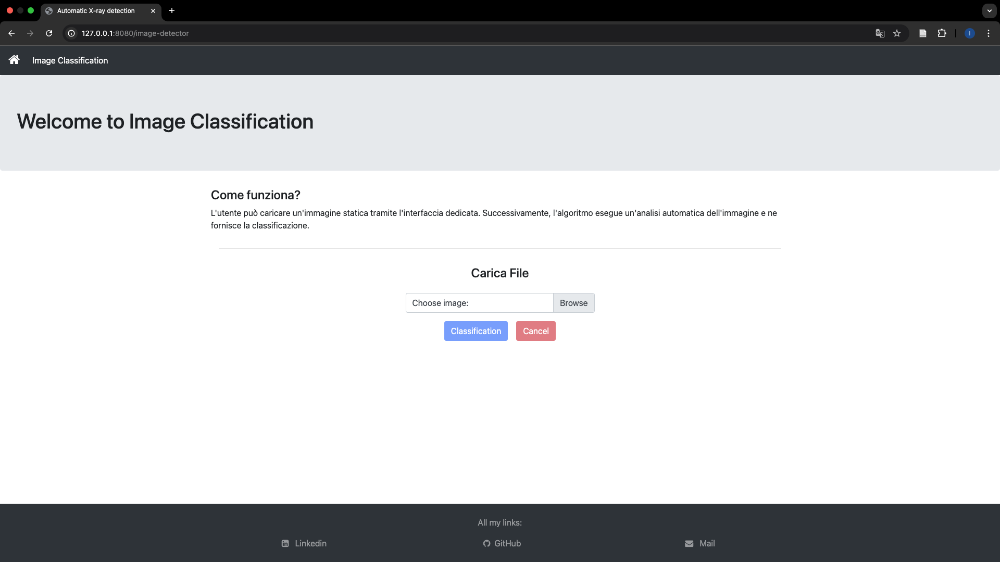
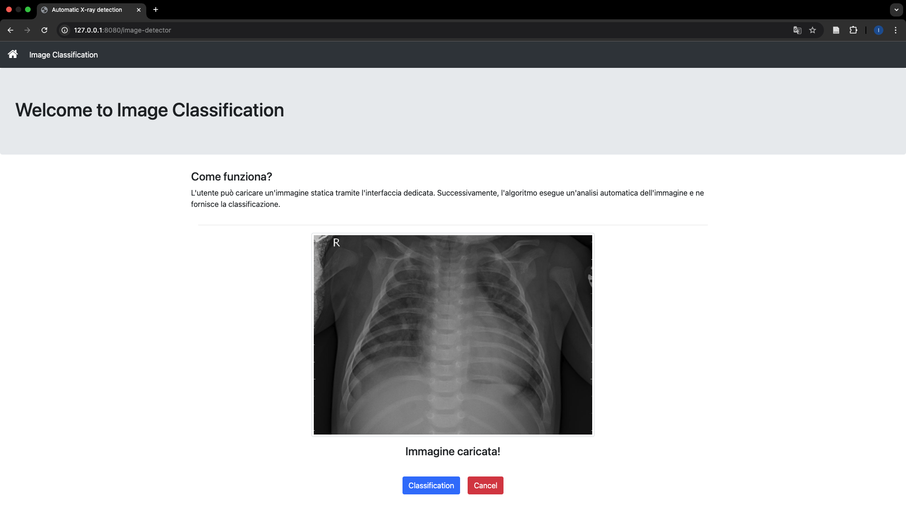
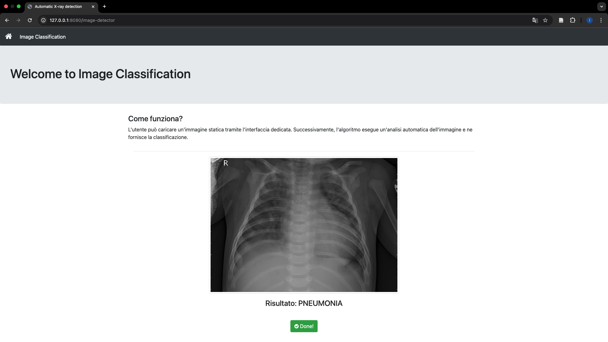

# Automatic X-ray Image Detection of Pneumonia and COVID-19

## Descrizione del progetto
L'obiettivo di questo progetto è stato quello di sviluppare una wep application in grado di classificare automaticamente i pazienti sulla base delle loro immagini a raggi X. Il sistema distingue tra tre classi principali:
- **Pazienti sani (NORMAL)**
- **Pazienti con polmonite (PNEUMONIA)**
- **Pazienti con COVID-19 (COVID19)**

Grazie all'impiego di tecniche di deep learning, il modello sviluppato ha dimostrato elevate performance di classificazione.

---
## Tecnologie utilizzate

Flask, PyTorch, Pandas, Numpy, Matplotlib, OpenCV

---
## Architettura della rete
La rete che è stata utilizzata è la seguente:

[](app/static/images/net.png)

Per migliorare la generalizzazione del modello, ho utilizzato tecniche di data augmentation (ridimensionamento, rotazione, flip orizzontali, ecc.) durante l'allenamento. Questo approccio ha potenziato la capacità del modello di clafficare le immagini in condizioni diverse.

---
## Risultati del modello
Il sistema di deep learning è stato valutato utilizzando una matrice di confusione e metriche di classificazione come precision, recall e F1-score. I risultati ottenuti sono i seguenti:

| Classe      | Precision | Recall | F1-Score | Support |
|-------------|-----------|--------|----------|---------|
| **COVID19** | 0.98      | 0.90   | 0.94     | 116     |
| **PNEUMONIA** | 0.94     | 0.89   | 0.91     | 317     |
| **NORMAL**   | 0.95     | 0.98   | 0.96     | 855     |

**Accuratezza totale:** 95%  
**Macro average:**  
- Precision: 0.96  
- Recall: 0.92  
- F1-score: 0.94  

**Weighted average:**  
- Precision: 0.95  
- Recall: 0.95  
- F1-score: 0.95  

### Matrice di confusione
La matrice di confusione evidenzia i risultati dettagliati delle predizioni del modello:

[](app/static/images/CM_LwCoronNet.png)

---

## Web-App
Per mettere in produzione il modello, è stata sviluppata una **web-app** che consente agli utenti di caricare immagini a raggi X e ottenere la classificazione in tempo reale. La web-app è stata progettata con un'interfaccia semplice e intuitiva, facilitando l'uso anche a personale medico non specializzato in analisi dei dati.

## Anteprima della Web-App
Ecco alcune schermate della web-app sviluppata (clicca per ingrandire):

| Schermata 1                          | Schermata 2                          |
|--------------------------------------|--------------------------------------|
| [](app/static/images/webapp/page_1.png) | [](app/static/images/webapp/page_2.png) |
| Schermata 3                          | Schermata 4                          |
| [](app/static/images/webapp/page_3.png) | [](app/static/images/webapp/page_4.png) |


---

## Come utilizzare il progetto
### Prerequisiti
1. Python 3.8 o versioni successive
2. Librerie richieste (vedi `requirements.txt`)

### Installazione

Per eseguire il progetto localmente, segui questi passaggi:

1. Clona il repository:
   ```bash
   git clone https://github.com/lorenzodefeo/Automatic-X-ray-image-detection-of-pneumonia-and-COVID-19.git
   ```

2. Accedi alla cartella del progetto:
   ```bash
   cd Automatic-X-ray-Image-Detection-of-Pneumonia-and-COVID-19
   ```

3. Installa le dipendenze richieste:
   ```bash
   pip install -r requirements.txt
   ```

4. Avvia il server Flask:
   ```bash
   python server_wsgi.py
   ```

5. Apri il browser e naviga all'indirizzo:
   ```
   http://localhost:5000
   ```
   oppure
   ```
   http://127.0.0.1:8080
   ```
---

## Struttura del Repository

Il progetto è organizzato nelle seguenti directory e file principali

```
Automatic-X-ray-Image-Detection-of-Pneumonia-and-COVID-19/
│
├── app/
│   ├── __init__.py             # Inizializzazione del pacchetto
│   ├── config.py               # File di configurazione
│   │
│   ├── errors/
│   │   ├── __init__.py         # Inizializzazione del pacchetto
│   │   └── routes.py           # Gestione delle rotte per errori
│   ├── main/
│   │   ├── __init__.py         # Inizializzazione del pacchetto
│   │   └── routes.py           # Gestione delle 'rotte' principali
│   ├── static/                 # File statici (CSS, JS, immagini)
│   └── templates/              # Template HTML
│       ├── error.html          # Template per errori
│       ├── home_page.html      # Template per la pagina principale
│       ├── image_detector.html # Template per il rilevamento immagini
│       ├── index.html          # Template per l'indice
│       └── template.html       # Template generico
│
├── models/                         # Modelli e file relativi ai dati
│
├── training_results/               # Risultati dell'allenamnto della rete
│
├── training_results_undersampling/ # Risultati dell'allenamnto della rete dopo il bilanciamnto del datast con undersampling
│
├── server_wsgi.py             # Script di avvio
├── requirements.txt           # Librerie necessarie
├── LICENSE                    # Licenza
└── README.md                  # Documentazione del progetto

```
---

## Licenza
Questo progetto è distribuito sotto licenza [MIT](https://opensource.org/licenses/MIT).